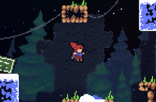
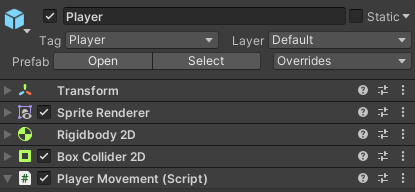
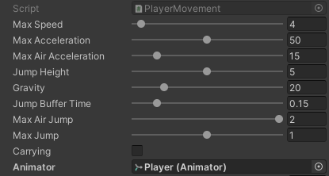

# Design

The **first questions** we need to ask ourselves when crafting a
movement system are **design-related** ! this may seem daunting at first
but, trust me, it is really important as it prevents you to spend too
much time and efforts on unnececary functionnalities or just chose the
wrong parameters and build your game around a system which you feel
doesn't play like you'd want to. This following section is dedicated to
guid you through some of the question you might want to ask yourself
instead of jumping head first into the code.

## movements according to your design

when it comes to the platformer genre, there are many questions yet to be
asked. One of the first ones comes down to the precise genre of your game
: what type of gameplay do you need for your player to **behave
accordingly to your world.** This is a very open question so let's try
narrowing it down by giving you some exemples:

### what game are you making ?

the first thing to do is to determine the precise subgenre of your game
(or find the closest one if yours do not belong to any) and try
understanding what are the main caracteritics of it's movement system.
Here are some common genre might want to look into :

-   hardcore plateformer

-   cinematic plateformer

-   metroid vania

-   puzzle plateformer

keep in mind that each genre as its own codes and uses, a
**Metroid-Vania** for Exemple will put the emphasis on **Exploration**
rather than intricate plateforming sequence, which will generaly be more
tough of in **Hardcore plateformers**. So your movement system will need
to adapt in consequence.

### How should your player behave ?

How your player behave mainly depends on how you want your game to feel,
but they are some guidelines: Depending on the genre, your may want to
have a different behaviour. As a matter of exemple, Hardcore
plateformers tends to have either very precise controls systems (like
tight are control and precise jumps) or ones with high granularity (do
not worry, this will be explained later), maximizing the ability to
master one's system. For exemple, a variable jump height will require a
mastery of the jump button timing, which might be exactly you want your
players to achieve. On the other hand, a Cinematic Plateformer might
want the movement system to stick to the main character's morphology,
making them identify more.

### some exemples

To give you a better idea of what could be expected depending on the
genre, here are some exemples :

  Game Name | Genre  | Movement caracteritics
  ---:| :---:| :---
  Celeste      |     Hardcore Plateformer  |   precise, reponsive and permissive
  Super Meat Boy  |  Hardcore Plateformer           |         slippery and heavy
  Another World   |  cinematic plateformer       |          stiff and human-like
  Hollow Knight   |      Metroid-Vania         |            light and permissive
  Limbo     |         puzzle plateformer         |          stiff and human-like

(note here that Celeste's movement system differ radically with
meatboy's, this is a perfect exemple that there are no real rules, as long
as your movement system feels right to you and to your players, the key here is to play test a LOT).

## granularity

The last topic I wanted to discuss before starting to implent our very
own system is **granularity**.

this word may seem a little scary at first but it is really a fairly
simple complex. all you need to know is that, the higher the granularity
of a system, the more precise it is. To understand it a little better,
let's retake an exemple form earlier: **the height of a jump**

-   the variation of your jump height can be pretty simple : no
    variation what so ever, you press the button, you jump. as simple as
    that.

-   we can take our system to an higher level of granularity : if you
    press the button long enough,past a certain treshol you make a big
    jump. this is good, but still a little unprecise, so let's take it
    up a notch

-   you could have a high granularity system if your jump height
    depended on how long your button press was, which will be a pretty
    precise system.

So a quick checkup on your system's granularity might be a good idea :)

# Implementation

Now that we've took care of our design, It's time to code ! \"but,what
if my game's movement differs from yours ?\" you may ask. Well do not
worry, the piece of code we're about to produce is versatile enough that
it should corespond to most plateformers out there (at least the classic
\"move and jump aroud\" ones) PLUS ! it is **completely tweakable ;)**

## Object settings

when creating our player object, we'd like to add some components




notice how we use a RigidBody2D and a BoxCollider2D to handle collisions
and gravity. on that very RigidBody2D you might want to block rotations on
the z axis.

## Variables

first, we will need a handful of variables:

``` {.numberLines .csh language="csh" numbers="left" frame="single"}
[SerializeField, Range(0f, 100f)]
    float maxSpeed=10f;

    [SerializeField, Range(0f, 100f)]
    float maxAcceleration=10f,maxAirAcceleration=1f;

    [SerializeField, Range(0f, 10f)]
    float jumpHeight=2f;

    [SerializeField, Range(0f, 100f)]
    float gravity=90f;

    [SerializeField, Range(0f, 1f)]
    float jumpBufferTime=0.2f;
    float jumpBufferCounter;

    [SerializeField, Range(0, 2)]
    int maxAirJump=2, maxJump=1;
    int JumpCount;

    bool desiredJump;
    bool onGround = true;

    Vector3 velocity, desiredVelocity;

    Rigidbody2D body;
```

note that the presence of \"SerializeField\" make the value tweakable
from the editor, which comes in handy to test different parameters and
decide which one fills the best ,which will look somewhat like this :



## Inputs

first, lets take care of our outputs, since unity already provides
dedicated functions, lets not make our life harder by not using them: we
want our player to move left and right while being able to jump, so
we'll need a 2D vector to represent the direction our player will face

``` {.numberLines .csh language="csh" numbers="left" frame="single"}
Vector2 playerInput;
    playerInput.x = Input.GetAxis("Horizontal");
    playerInput.y = 0.0f;
    playerInput = Vector2.ClampMagnitude(playerInput, 1f);
    desiredJump |= Input.GetButtonDown("Jump");
```

this code will take place in the Update method of our Player. So it will
be updated every frame. notice how we clamped the magnitude of
PlayerInput by one ? this is done to prevent cases where
$PlayerInput = \overrightarrow{v}, ||\overrightarrow{v}|| > 1$ this
happens when $\sqrt{x^{2} + y^{2}} > 1$, x being playerInput.x and y
being playerInput.y which could cause the player to go abnormally faster
when heading toward certain very specific directions. To avoid this, we
normalize the direction vector.

## velocity

now that we have our inputs, let's compute the actual movements

``` {.numberLines .csh language="csh" numbers="left" frame="single"}
//inside Update
desiredVelocity = new Vector3(playerInput.x,
                 playerInput.y,0f)*maxSpeed;

//new FixedUpdate function
void FixedUpdate(){
    velocity=body.velocity;
    float acceleration=onGround ?
    maxAcceleration:maxAirAcceleration;

    float maxSpeedChange=acceleration*Time.deltaTime;

    velocity.x = Mathf.MoveTowards(velocity.x,
            desiredVelocity.x,maxSpeedChange);
    velocity.z = Mathf.MoveTowards(velocity.z,
            desiredVelocity.z,maxSpeedChange);
}
```

we compute the desired velovity as the direction vector (of magnitude 1)
multiplied by the maximum speed, then we move toward it, using the
Mathf.MoveTowards method (which is basically a linear
interpolation[@Lerp] with taking in account the maxSpeedChange
variable).

Notice the ternary opperator when assigning the value of acceleration :
this allows us to change the level of control we have on the Player when
mid-air. We also multiply the maxSpeedChange by $\Delta t$, which
prevents speed of the player to be modified during lag spikes (as it is
now,in a way, computed relative to the frame rate).

## Jumps

it is now time to fiddle around with jumps a little bit :

``` {.numberLines .csh language="csh" numbers="left" frame="single"}
void Jump(){
    if(onGround || JumpCount>0)
    {
        float jumpSpeed = Mathf.Sqrt(-2f *
            Physics.gravity.y * jumpHeight);
        if (velocity.y > 0f) {
            jumpSpeed = Mathf.Max(jumpSpeed
                            - velocity.y, 0f);
        }
        velocity.y += jumpSpeed;
    }
}
```

the last thing we need to check is if we're colliding with the ground :

``` {.numberLines .csh language="csh" numbers="left" frame="single"}
void OnCollisionEnter2D (Collision2D collision) {
        onGround = true;
    }

    void OnCollisionStay2D (Collision2D collision) {
        onGround = true;
    }
```

we could make it more precise by checking the floor's normal vector and
setting onGround to true only if the y component of the normalized
normal vector is superior to 0.9. then, simply add a condition in the
LateUpadte method to execute the jump function while desiredJump is
True. you now have a jump !Heck, you even have a full plateformer
movement system !

# Some Improvements

BUT \... we could make it even better with some slight improvements !

## Buffured jumps

Buffered jumps stands for a very very conveniant system that adds a lot
to any plateformer from an accessibility point of view. The idea is
simple : when the jump button is pressed, init a timer for only a few
frames and if the ground is touched during the lifespan of this timer,
the player will jump automatically. This prevents the frustration of
pressing the jump button only a few frames before landing and ending up
not juming. to Implement it, just had those lines in FixedUpdate:

``` {.numberLines .csh language="csh" numbers="left" frame="single"}
if (desiredJump)
        jumpBufferCounter = jumpBufferTime;
    else
        jumpBufferCounter -= Time.deltaTime;

    if(jumpBufferCounter>0f)
    {
        desiredJump = false;
        JumpCount--;
        Jump();
    }
```

and this line into the Jump function :

``` {.numberLines .csh language="csh" numbers="left" frame="single"}
jumpBufferCounter = 0f;
```
## Coyote Time

Coyote time may seems like a silly name but it stands for exactly the
opposite of the Buffered Jump when you leave the ground, it gives you a
few frames to jump. It works the nearly same and can be implemented in the same
manner (execpt this time the timer starts when we leave the ground without jumping and we check for input on the jump button).

## Finally

They are still a LOT of improvements we could make to our code but this
is fairly decent and will allow you to play around for a bit. of course,
we could always refactor our code to take it up to the industry
standards, but this is not the purpose of the article.

We then learned how to code a simple yet solid plateformer movement
code, along with the questions you need to ask yourself in order to
decide what exactly you want to build. Of course this is not perfect,
feel free to improve or tweak it as you please ! Thanks for reading !!
